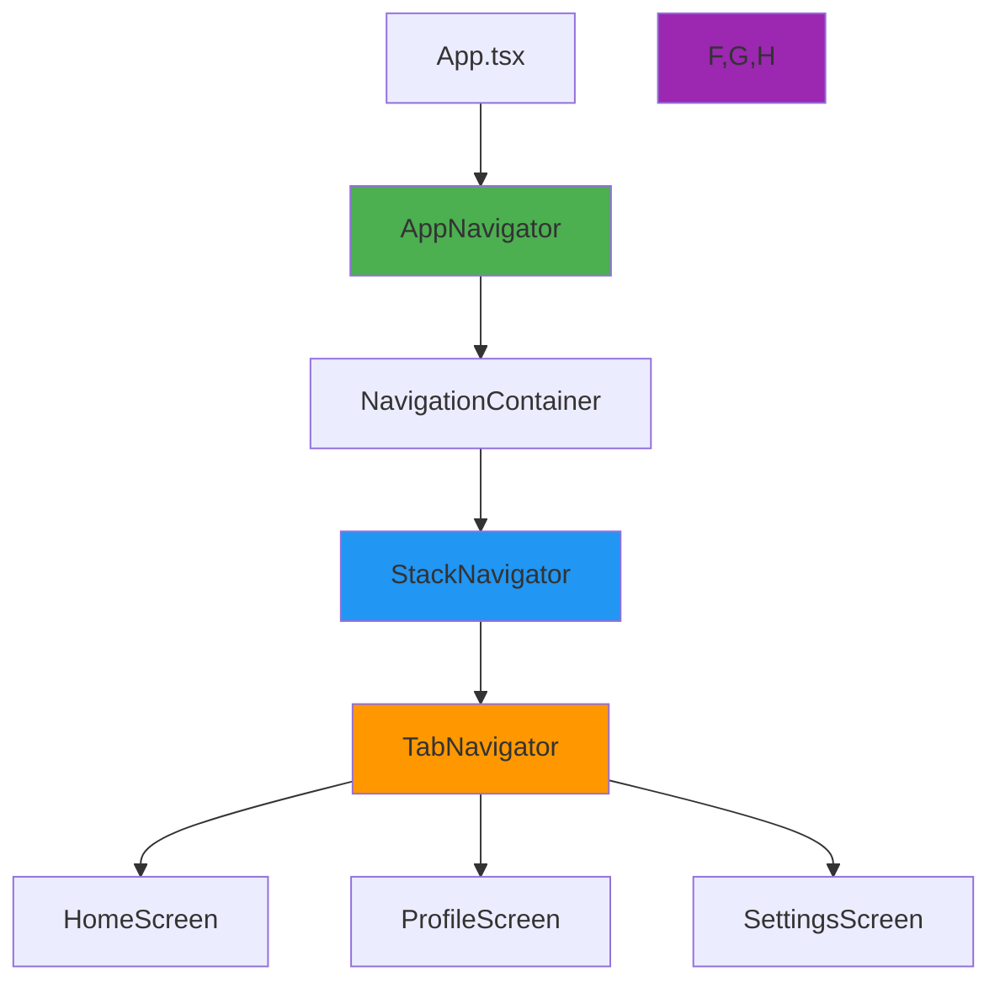

## Overview

AgroVetsApp uses **React Navigation 7.x** to manage navigation between screens. The navigation system is built with a hierarchical structure combining multiple navigator types for a flexible and scalable routing architecture.

## Navigation Architecture

### Navigation Hierarchy



### Layer Breakdown

<Steps>
  <Step title="App Entry Point">
    `App.tsx` initializes the navigation system
  </Step>
  <Step title="AppNavigator">
    Wraps navigators in `NavigationContainer`
  </Step>
  <Step title="StackNavigator">
    Manages screen stack and transitions
  </Step>
  <Step title="TabNavigator">
    Provides bottom tab navigation
  </Step>
  <Step title="Screens">
    Individual screen components
  </Step>
</Steps>

## Navigator Components

### 1. AppNavigator

**File**: `src/navigation/AppNavigator.tsx` (12 lines)

**Purpose**: Root navigator that wraps all other navigators in `NavigationContainer`.

```typescript src/navigation/AppNavigator.tsx
import React from 'react';
import { NavigationContainer } from '@react-navigation/native';
import StackNavigator from './StackNavigator';

export default function AppNavigator() {
  return (
    <NavigationContainer>
      <StackNavigator />
    </NavigationContainer>
  );
}
```

#### Responsibilities

<AccordionGroup>
  <Accordion title="Navigation Context">
    Provides the navigation context to the entire app through `NavigationContainer`.
  </Accordion>
  
  <Accordion title="Deep Linking">
    Can be configured to handle deep links and universal links (future enhancement).
  </Accordion>
  
  <Accordion title="Navigation State">
    Manages global navigation state and history.
  </Accordion>
  
  <Accordion title="Theme Integration">
    Can apply navigation theme for consistent styling.
  </Accordion>
</AccordionGroup>

#### Future Enhancements

```typescript Enhanced AppNavigator
import React from 'react';
import { NavigationContainer } from '@react-navigation/native';
import { useColorScheme } from 'react-native';
import StackNavigator from './StackNavigator';

const linking = {
  prefixes: ['agrovets://', 'https://agrovets.app'],
  config: {
    screens: {
      Home: 'home',
      Profile: 'profile',
      Settings: 'settings',
    },
  },
};

export default function AppNavigator() {
  const scheme = useColorScheme();
  
  return (
    <NavigationContainer 
      linking={linking}
      theme={scheme === 'dark' ? DarkTheme : DefaultTheme}
    >
      <StackNavigator />
    </NavigationContainer>
  );
}
```

### 2. StackNavigator

**File**: `src/navigation/StackNavigator.tsx` (15 lines)

**Purpose**: Manages hierarchical screen navigation with stack-based transitions.

```typescript src/navigation/StackNavigator.tsx
import React from 'react';
import { createNativeStackNavigator } from '@react-navigation/native-stack';
import TabNavigator from './TabNavigator';
import { RootStackParamList } from './types';

const Stack = createNativeStackNavigator<RootStackParamList>();

export default function StackNavigator() {
  return (
    <Stack.Navigator screenOptions={{ headerShown: false }}>
      <Stack.Screen name="Home" component={TabNavigator} />
    </Stack.Navigator>
  );
}
```

#### Key Features

<CardGroup cols={2}>
  <Card title="Native Performance" icon="gauge-high">
    Uses `createNativeStackNavigator` for platform-native transitions
  </Card>
  
  <Card title="Type Safety" icon="shield-check">
    Typed with `RootStackParamList` for compile-time route validation
  </Card>
  
  <Card title="Header Control" icon="bars">
    Headers disabled (`headerShown: false`) for custom UI control
  </Card>
  
  <Card title="Extensible" icon="layer-plus">
    Easy to add more screens to the stack
  </Card>
</CardGroup>

#### Screen Options

```typescript Stack Navigator Options
<Stack.Navigator 
  screenOptions={{
    headerShown: false,           // Hide default header
    animation: 'slide_from_right', // Transition animation
    gestureEnabled: true,          // Swipe to go back
    orientation: 'portrait',       // Lock orientation
  }}
>
  <Stack.Screen name="Home" component={TabNavigator} />
  <Stack.Screen name="Detail" component={DetailScreen} />
</Stack.Navigator>
```

### 3. TabNavigator

**File**: `src/navigation/TabNavigator.tsx` (19 lines)

**Purpose**: Bottom tab navigation for main app sections.

```typescript src/navigation/TabNavigator.tsx
import React from 'react';
import { createBottomTabNavigator } from '@react-navigation/bottom-tabs';
import HomeScreen from '../screens/Home/HomeScreen';
import ProfileScreen from '../screens/Profile/ProfileScreen';
import SettingsScreen from '../screens/Settings/SettingsScreen';
import { RootStackParamList } from './types';

const Tab = createBottomTabNavigator<RootStackParamList>();

export default function TabNavigator() {
  return (
    <Tab.Navigator screenOptions={{ headerShown: false }}>
      <Tab.Screen name="Home" component={HomeScreen} />
      <Tab.Screen name="Profile" component={ProfileScreen} />
      <Tab.Screen name="Settings" component={SettingsScreen} />
    </Tab.Navigator>
  );
}
```

#### Current Tabs

<Tabs>
  <Tab title="Home">
    **Route**: `Home`
    
    **Component**: `HomeScreen`
    
    **Purpose**: Main landing screen with app overview and key information.
    
    ```typescript src/screens/Home/HomeScreen.tsx
    export default function HomeScreen() {
      return (
        <View style={styles.container}>
          <Text style={styles.title}>Inicio</Text>
          <Text>Pantalla Home — contenido de ejemplo.</Text>
        </View>
      );
    }
    ```
  </Tab>
  
  <Tab title="Profile">
    **Route**: `Profile`
    
    **Component**: `ProfileScreen`
    
    **Purpose**: User profile and account management.
  </Tab>
  
  <Tab title="Settings">
    **Route**: `Settings`
    
    **Component**: `SettingsScreen`
    
    **Purpose**: Application settings and preferences.
  </Tab>
</Tabs>

#### Enhanced Tab Configuration

```typescript Enhanced TabNavigator
import React from 'react';
import { createBottomTabNavigator } from '@react-navigation/bottom-tabs';
import { Ionicons } from '@expo/vector-icons';
import HomeScreen from '../screens/Home/HomeScreen';
import ProfileScreen from '../screens/Profile/ProfileScreen';
import SettingsScreen from '../screens/Settings/SettingsScreen';

const Tab = createBottomTabNavigator();

export default function TabNavigator() {
  return (
    <Tab.Navigator
      screenOptions={({ route }) => ({
        headerShown: false,
        tabBarIcon: ({ focused, color, size }) => {
          let iconName;
          
          if (route.name === 'Home') {
            iconName = focused ? 'home' : 'home-outline';
          } else if (route.name === 'Profile') {
            iconName = focused ? 'person' : 'person-outline';
          } else if (route.name === 'Settings') {
            iconName = focused ? 'settings' : 'settings-outline';
          }
          
          return <Ionicons name={iconName} size={size} color={color} />;
        },
        tabBarActiveTintColor: '#0a84ff',
        tabBarInactiveTintColor: 'gray',
        tabBarStyle: {
          paddingBottom: 5,
          height: 60,
        },
      })}
    >
      <Tab.Screen 
        name="Home" 
        component={HomeScreen}
        options={{ tabBarLabel: 'Inicio' }}
      />
      <Tab.Screen 
        name="Profile" 
        component={ProfileScreen}
        options={{ tabBarLabel: 'Perfil' }}
      />
      <Tab.Screen 
        name="Settings" 
        component={SettingsScreen}
        options={{ tabBarLabel: 'Ajustes' }}
      />
    </Tab.Navigator>
  );
}
```

### 4. DrawerNavigator

**File**: `src/navigation/DrawerNavigator.tsx` (16 lines)

**Status**: Placeholder implementation

```typescript src/navigation/DrawerNavigator.tsx
import React from 'react';
import { View, Text, StyleSheet } from 'react-native';

export default function DrawerNavigator() {
  return (
    <View style={styles.container}>
      <Text style={styles.text}>DrawerNavigator — placeholder</Text>
    </View>
  );
}

const styles = StyleSheet.create({
  container: { flex: 1, alignItems: 'center', justifyContent: 'center' },
  text: { fontSize: 16 },
});
```

<Note>
  The Drawer Navigator is a placeholder for future implementation. When implemented, it will provide a side drawer menu for additional navigation options.
</Note>

#### Future Implementation

```typescript Future DrawerNavigator
import React from 'react';
import { createDrawerNavigator } from '@react-navigation/drawer';
import TabNavigator from './TabNavigator';
import AboutScreen from '../screens/About/AboutScreen';
import HelpScreen from '../screens/Help/HelpScreen';

const Drawer = createDrawerNavigator();

export default function DrawerNavigator() {
  return (
    <Drawer.Navigator>
      <Drawer.Screen name="Main" component={TabNavigator} />
      <Drawer.Screen name="About" component={AboutScreen} />
      <Drawer.Screen name="Help" component={HelpScreen} />
    </Drawer.Navigator>
  );
}
```

## Type System

### Navigation Types

**File**: `src/navigation/types.ts` (6 lines)

```typescript src/navigation/types.ts
export type RootStackParamList = {
  Home: undefined;
  Profile: undefined;
  Settings: undefined;
};
```

### Type Safety Benefits

<CardGroup cols={2}>
  <Card title="Compile-Time Validation" icon="shield-check">
    TypeScript catches navigation errors before runtime
  </Card>
  
  <Card title="Autocomplete" icon="wand-magic-sparkles">
    IDE provides intelligent suggestions for routes
  </Card>
  
  <Card title="Parameter Validation" icon="check-double">
    Ensures correct params are passed to screens
  </Card>
  
  <Card title="Refactoring Safety" icon="code-branch">
    Rename routes with confidence using IDE refactoring
  </Card>
</CardGroup>

### Using Navigation with Types

```typescript Using Typed Navigation
import { NativeStackNavigationProp } from '@react-navigation/native-stack';
import { RootStackParamList } from '../navigation/types';

type HomeScreenNavigationProp = NativeStackNavigationProp<
  RootStackParamList,
  'Home'
>;

interface Props {
  navigation: HomeScreenNavigationProp;
}

function HomeScreen({ navigation }: Props) {
  // TypeScript knows 'Profile' is a valid route
  const goToProfile = () => {
    navigation.navigate('Profile');
  };
  
  // TypeScript error: 'InvalidRoute' doesn't exist
  // navigation.navigate('InvalidRoute');
  
  return (
    <Button title="Go to Profile" onPress={goToProfile} />
  );
}
```

### Adding Parameters to Routes

```typescript Route Parameters
export type RootStackParamList = {
  Home: undefined;
  Profile: { userId: string };
  Settings: undefined;
  Detail: { itemId: number; title: string };
};

// Navigate with params
navigation.navigate('Profile', { userId: '123' });
navigation.navigate('Detail', { itemId: 42, title: 'Item' });

// Access params in screen
import { RouteProp } from '@react-navigation/native';

type DetailScreenRouteProp = RouteProp<RootStackParamList, 'Detail'>;

interface Props {
  route: DetailScreenRouteProp;
}

function DetailScreen({ route }: Props) {
  const { itemId, title } = route.params;
  // ...
}
```

## Navigation Patterns

### Basic Navigation

```typescript Navigate to Screen
import { useNavigation } from '@react-navigation/native';

function MyComponent() {
  const navigation = useNavigation();
  
  return (
    <Button 
      title="Go to Profile" 
      onPress={() => navigation.navigate('Profile')} 
    />
  );
}
```

### Going Back

```typescript Go Back
navigation.goBack();

// Or check if can go back
if (navigation.canGoBack()) {
  navigation.goBack();
} else {
  navigation.navigate('Home');
}
```

### Resetting Navigation

```typescript Reset Stack
import { CommonActions } from '@react-navigation/native';

// Reset to Home screen
navigation.dispatch(
  CommonActions.reset({
    index: 0,
    routes: [{ name: 'Home' }],
  })
);
```

### Nested Navigation

```typescript Navigate in Nested Navigator
// Navigate to a specific tab
navigation.navigate('Home', {
  screen: 'Profile',
});
```

## Navigation Hooks

### useNavigation

```typescript
import { useNavigation } from '@react-navigation/native';

const navigation = useNavigation();
navigation.navigate('Profile');
```

### useRoute

```typescript
import { useRoute } from '@react-navigation/native';

const route = useRoute();
const { itemId } = route.params;
```

### useFocusEffect

```typescript
import { useFocusEffect } from '@react-navigation/native';

useFocusEffect(
  React.useCallback(() => {
    // Do something when screen is focused
    fetchData();
    
    return () => {
      // Cleanup when screen is unfocused
      cancelRequests();
    };
  }, [])
);
```

### useIsFocused

```typescript
import { useIsFocused } from '@react-navigation/native';

const isFocused = useIsFocused();

if (isFocused) {
  // Screen is focused
}
```

## Screen Transitions

### Custom Transitions

```typescript
<Stack.Navigator
  screenOptions={{
    animation: 'slide_from_right',
    // or: 'slide_from_left', 'slide_from_bottom', 'fade', 'flip', 'none'
  }}
>
  <Stack.Screen name="Home" component={HomeScreen} />
</Stack.Navigator>
```

### Per-Screen Transitions

```typescript
<Stack.Screen 
  name="Modal" 
  component={ModalScreen}
  options={{
    presentation: 'modal',
    animation: 'slide_from_bottom',
  }}
/>
```

## Best Practices

<AccordionGroup>
  <Accordion title="Use Type-Safe Navigation">
    Always define and use `RootStackParamList` for type-safe navigation.
    
    ```typescript
    export type RootStackParamList = {
      Home: undefined;
      Detail: { id: string };
    };
    ```
  </Accordion>
  
  <Accordion title="Centralize Navigation Logic">
    Keep all navigator configuration in `src/navigation/` directory.
    
    Avoid creating navigators in screen components.
  </Accordion>
  
  <Accordion title="Use Navigation Hooks">
    Prefer `useNavigation()` hook over props drilling.
    
    ```typescript
    const navigation = useNavigation();
    ```
  </Accordion>
  
  <Accordion title="Screen-Specific Options">
    Configure screen options at the Screen level for better organization.
    
    ```typescript
    <Stack.Screen 
      name="Home" 
      component={HomeScreen}
      options={{
        title: 'Home',
        headerShown: true,
      }}
    />
    ```
  </Accordion>
  
  <Accordion title="Deep Linking Configuration">
    Set up deep linking early for better user experience.
    
    ```typescript
    const linking = {
      prefixes: ['agrovets://'],
      config: { screens: { Home: 'home' } },
    };
    ```
  </Accordion>
</AccordionGroup>

## Performance Optimization

### Lazy Loading Screens

```typescript
import React, { lazy, Suspense } from 'react';

const ProfileScreen = lazy(() => import('../screens/Profile/ProfileScreen'));

<Stack.Screen name="Profile">
  {() => (
    <Suspense fallback={<LoadingScreen />}>
      <ProfileScreen />
    </Suspense>
  )}
</Stack.Screen>
```

### Prevent Unnecessary Re-renders

```typescript
import React, { memo } from 'react';

const HomeScreen = memo(function HomeScreen() {
  // Screen component
});
```

## Testing Navigation

### Mock Navigation

```typescript
import { NavigationContainer } from '@react-navigation/native';
import { render } from '@testing-library/react-native';

const mockNavigation = {
  navigate: jest.fn(),
  goBack: jest.fn(),
};

test('navigates to profile', () => {
  const { getByText } = render(
    <NavigationContainer>
      <HomeScreen navigation={mockNavigation} />
    </NavigationContainer>
  );
  
  fireEvent.press(getByText('Go to Profile'));
  expect(mockNavigation.navigate).toHaveBeenCalledWith('Profile');
});
```

## Next Steps

<CardGroup cols={2}>
  <Card title="Architecture Overview" icon="sitemap" href="/architecture/overview">
    Understand the overall application architecture
  </Card>
  
  <Card title="Project Structure" icon="folder-tree" href="/architecture/project-structure">
    Explore the detailed file organization
  </Card>
  
  <Card title="Development Guide" icon="code" href="/development">
    Learn how to develop and extend the app
  </Card>
  
  <Card title="React Navigation Docs" icon="book" href="https://reactnavigation.org/docs/getting-started">
    Official React Navigation documentation
  </Card>
</CardGroup>
