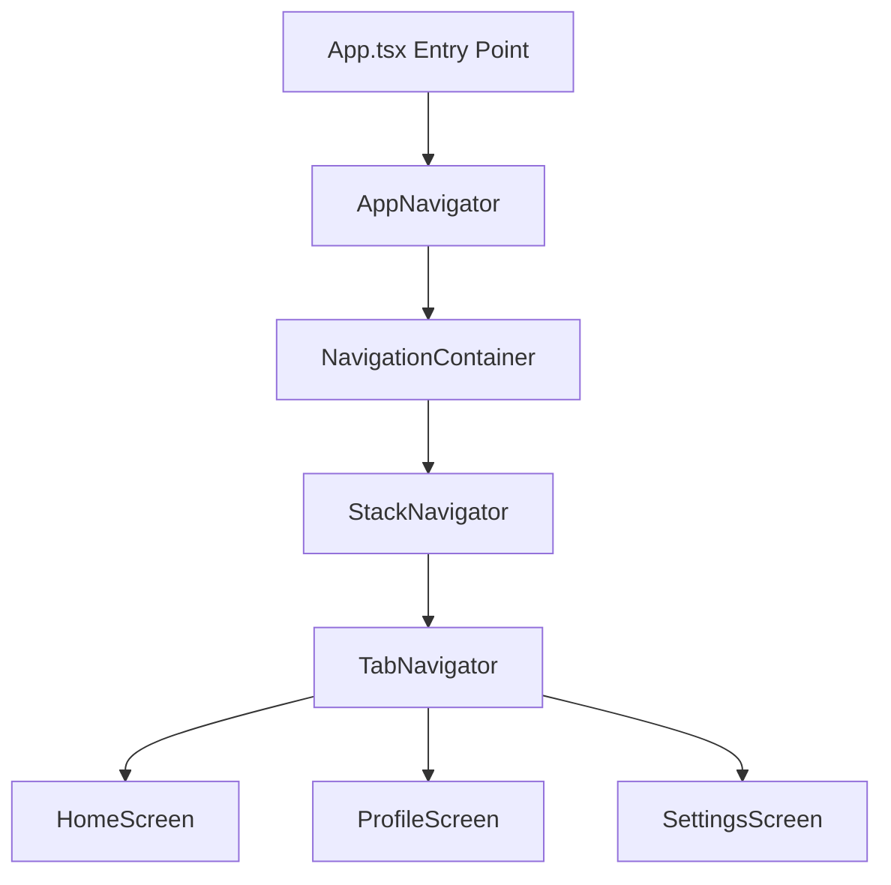

## Introduction

AgroVetsApp is a React Native mobile application built with Expo, designed to provide a modern, cross-platform solution for agricultural veterinary services. The application follows React Native best practices and leverages the Expo ecosystem for rapid development and deployment.

## Technology Stack

<CardGroup cols={2}>
  <Card title="Frontend Framework" icon="react">
    **React 19.1.0** with **React Native 0.81.5**
    
    Latest stable versions providing modern React features and optimal mobile performance.
  </Card>
  
  <Card title="Development Platform" icon="mobile">
    **Expo ~54.0.25**
    
    Comprehensive platform for building, deploying, and iterating on iOS, Android, and web apps.
  </Card>
  
  <Card title="Navigation" icon="route">
    **React Navigation 7.x**
    
    Industry-standard navigation library with Stack, Tab, and Drawer navigators.
  </Card>
  
  <Card title="Language" icon="code">
    **TypeScript ~5.9.2**
    
    Strict type checking enabled for enhanced code quality and developer experience.
  </Card>
</CardGroup>

### Core Dependencies

```json package.json
{
  "dependencies": {
    "@react-navigation/bottom-tabs": "^7.8.8",
    "@react-navigation/native": "^7.1.22",
    "@react-navigation/native-stack": "^7.8.2",
    "expo": "~54.0.25",
    "expo-status-bar": "~3.0.8",
    "react": "19.1.0",
    "react-native": "0.81.5",
    "react-native-gesture-handler": "~2.28.0",
    "react-native-safe-area-context": "~5.6.0",
    "react-native-screens": "~4.16.0"
  }
}
```

## Design Principles

### 1. Component-Based Architecture

The application is structured using a component-based approach where UI elements are broken down into reusable, self-contained components. This promotes:

- **Reusability**: Components can be used across multiple screens
- **Maintainability**: Changes to a component propagate throughout the app
- **Testability**: Components can be tested in isolation

### 2. Type Safety First

TypeScript is configured with strict mode enabled, ensuring:

```json tsconfig.json
{
  "extends": "expo/tsconfig.base",
  "compilerOptions": {
    "strict": true
  }
}
```

All navigation routes, screen props, and component interfaces are strongly typed using TypeScript.

### 3. Modular Organization

Code is organized by feature and responsibility:

- **Screens**: Feature-based screen components
- **Navigation**: Centralized routing logic
- **Components**: Reusable UI elements
- **Services**: Business logic and API integrations
- **Utils**: Helper functions and utilities
- **Theme**: Centralized styling and theming

### 4. Cross-Platform Compatibility

<Note>
  The app is configured to run on **iOS**, **Android**, and **Web** platforms using a single codebase.
</Note>

Expo configuration supports all platforms:

```json app.json
{
  "expo": {
    "name": "AgroVetsApp",
    "platforms": ["ios", "android", "web"],
    "ios": {
      "supportsTablet": true
    },
    "android": {
      "adaptiveIcon": {
        "foregroundImage": "./assets/adaptive-icon.png",
        "backgroundColor": "#ffffff"
      },
      "edgeToEdgeEnabled": true
    },
    "web": {
      "favicon": "./assets/favicon.png"
    }
  }
}
```

## Application Architecture

### High-Level Flow



### Layer Architecture

<Tabs>
  <Tab title="Presentation Layer">
    **Screens & Components**
    
    - Screen components (`src/screens/*`)
    - UI components (`src/components/ui/*`)
    - Common components (`src/components/common/*`)
    
    Responsible for rendering UI and handling user interactions.
  </Tab>
  
  <Tab title="Navigation Layer">
    **Routing & Navigation**
    
    - AppNavigator: Root navigation setup
    - StackNavigator: Screen stacking
    - TabNavigator: Bottom tab navigation
    - DrawerNavigator: Side drawer (future)
    
    Manages app navigation flow and routing logic.
  </Tab>
  
  <Tab title="Business Logic Layer">
    **Services & Hooks**
    
    - API services (`src/services/*`)
    - Custom hooks (`src/hooks/*`)
    - Utilities (`src/utils/*`)
    
    Handles business logic, data fetching, and state management.
  </Tab>
  
  <Tab title="Styling Layer">
    **Theme & Styles**
    
    - Theme configuration (`src/theme/*`)
    - Component styles (StyleSheet)
    
    Centralized styling and theming system.
  </Tab>
</Tabs>

## Key Design Decisions

### Navigation Strategy

**Decision**: Use a hybrid navigation approach combining Stack and Tab navigators.

**Rationale**:
- Stack Navigator provides hierarchical screen navigation
- Tab Navigator offers quick access to main app sections
- Flexible architecture allows future addition of Drawer navigation

**Implementation**: See [Navigation System](/architecture/navigation-system) for details.

### State Management

**Current Approach**: Local component state with React hooks

**Future Considerations**:
- Context API for global state (themes, user data)
- Redux Toolkit or Zustand for complex state management
- React Query for server state management

### API Integration

**Pattern**: Service layer abstraction

```typescript src/services/api.ts
export async function fetchExample() {
  // Centralized API calls
  return { ok: true };
}
```

Benefits:
- Separation of concerns
- Easy to mock for testing
- Centralized error handling

### Component Design

**Pattern**: Functional components with TypeScript interfaces

Example from `src/components/ui/Button.tsx`:

```typescript
import React from 'react';
import { TouchableOpacity, Text, StyleSheet } from 'react-native';

export default function Button({ 
  children, 
  onPress 
}: { 
  children: React.ReactNode; 
  onPress?: () => void 
}) {
  return (
    <TouchableOpacity 
      style={styles.btn} 
      onPress={onPress} 
      activeOpacity={0.8}
    >
      <Text style={styles.txt}>{children}</Text>
    </TouchableOpacity>
  );
}
```

## Performance Optimizations

### React Native New Architecture

<Warning>
  The app is configured with `"newArchEnabled": true` to leverage React Native's new architecture.
</Warning>

This enables:
- **Fabric**: New rendering system for improved performance
- **TurboModules**: Faster native module loading
- **Concurrent rendering**: Better responsiveness

### Screen Optimization

Navigators are configured with `headerShown: false` to reduce unnecessary renders:

```typescript
<Stack.Navigator screenOptions={{ headerShown: false }}>
  <Stack.Screen name="Home" component={TabNavigator} />
</Stack.Navigator>
```

### Gesture Handling

Using `react-native-gesture-handler` for native gesture performance:

```typescript
import { GestureHandlerRootView } from 'react-native-gesture-handler';

export default function App() {
  return (
    <GestureHandlerRootView style={{ flex: 1 }}>
      <AppNavigator />
    </GestureHandlerRootView>
  );
}
```

## Platform-Specific Features

### Android

- **Edge-to-edge UI**: `edgeToEdgeEnabled: true`
- **Predictive back gesture**: Disabled for controlled navigation
- **Adaptive icons**: Custom adaptive icon support

### iOS

- **Tablet support**: Full iPad compatibility
- **Safe area handling**: Automatic safe area insets

### Web

- **Progressive Web App**: Can be deployed as PWA
- **Responsive design**: Adapts to different screen sizes

## Security Considerations

<Accordion title="Type Safety">
  TypeScript strict mode catches type errors at compile time, preventing runtime type-related bugs.
</Accordion>

<Accordion title="Navigation Types">
  All navigation routes are strongly typed using `RootStackParamList`, preventing navigation to non-existent screens.
</Accordion>

<Accordion title="Future Enhancements">
  - Environment variable management for API keys
  - Secure storage for sensitive data
  - Authentication and authorization layers
  - API request validation
</Accordion>

## Next Steps

<CardGroup cols={2}>
  <Card title="Project Structure" icon="folder-tree" href="/architecture/project-structure">
    Explore the detailed file and folder organization
  </Card>
  
  <Card title="Navigation System" icon="compass" href="/architecture/navigation-system">
    Deep dive into how navigation is implemented
  </Card>
  
  <Card title="Development Guide" icon="code" href="/development">
    Learn how to set up and develop the application
  </Card>
  
  <Card title="API Reference" icon="book" href="/api/navigation/app-navigator">
    Browse component and API documentation
  </Card>
</CardGroup>
